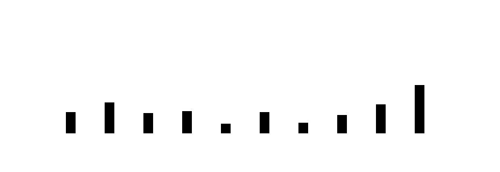

# STEP 00

Goals:

* Import D3 lib using JavsScript package managers
* Configuration and installation scripts
* Create a first D3 chart
* Understand key D3 concepts

## Node.js, NPM and Package.json

>💡 **[Node.js](https://nodejs.org/en/)** is a JavaScript runtime built on Chrome's V8 JavaScript engine.

>💡 **[NPM](https://www.npmjs.com/)** is the default package manager for Node.

>💡 **[package.json](https://docs.npmjs.com/getting-started/using-a-package.json)** is the description of npm packages.

Run `npm init --yes` to create a [package.json](result/package.json) with default values (by skipping interactive mode):

```json
{
  "name": "00",
  "version": "1.0.0",
  "description": "",
  "main": "index.js",
  "scripts": {
    "test": "echo \"Error: no test specified\" && exit 1"
  },
  "keywords": [],
  "author": "",
  "license": "ISC",
  "dependencies": {
    "d3": "^4.7.4"
  }
}
```

Now let's run a local dev environment

- run `npm install http-server -g`

(`-g` option is for global install, not just the local repository)

- run `http-server &` to launch the web server

- run `open http://127.0.0.1:8080` to open the browser

### Notes

* [http-server options](https://www.npmjs.com/package/http-server)
* [more details](https://github.com/d3/d3/wiki#local-development)
* Alternative to `http-server` is classic `python -m SimpleHTTPServer 8080`

## Create a first d3 chart

Now let's create a first D3 chart.

- First add D3 as an `npm` package dependency:

`npm install d3 --save`

It just did a bunch of things:

1. It added the following entry to the `package.json` file

```json
  "dependencies": {
    "d3": "^4.8.0"
  }
```

2. It created the `node_modules/` repository

3. It made the file `node_modules/d3/build/d3.js` available

4. It downloaded its dependancies

```
└─┬ d3@4.7.4 
  ├── d3-array@1.1.1 
  ├── d3-axis@1.0.6 
  ├── d3-brush@1.0.4 
  ├── d3-chord@1.0.4 
  ....
```

Now use the content of this file to create our first chart `[bar chart](result/barchart.html)`

```sh
> cat result/barchart.html >> barchart.html
```

Here is the output



### Notes

* Link to D3 [latest release](https://github.com/d3/d3/releases/tag/v4.8.0)
* Understand package versioning which uses [Semantic Versioning](https://docs.npmjs.com/getting-started/semantic-versioning):

```
Patch releases: 1.0 or 1.0.x or ~1.0.4
Minor releases: 1 or 1.x or ^1.0.4
Major releases: * or x
```

* To bump individual packages to their latest version use [`npm-check-updates`](https://github.com/tjunnone/npm-check-updates)
* You may want to add `node_modules/` to your `.gitignore`

## Understand key d3 concepts

How [`select` works](https://bost.ocks.org/mike/selection/):

```
// Selection en pur JS
function $(x) {
  return document.querySelectorAll(x);
}
```

How `append` works:

```
d3.select('body')
  .style('background', '#000')
  .on('click', function() {})
  .append('div');
```

..Which is equal to:

```
$('body')
  .css('background', '#000')
  .click(function() {})
  .append($('<div></div>'));
```

Data join

* Puts a data object and an element together
* Keeps track of change (new, updated or removed object)
* Transitionning to reflect the state's changes

### Notes

* [How data binding works](http://kristw.github.io/d3-data-binding/)
* [Thinking with Joins](https://bost.ocks.org/mike/join/)
* [General Update Pattern](https://bl.ocks.org/mbostock/3808218)
* [Object consistancy](https://bost.ocks.org/mike/constancy/)
* [Joining Data](https://github.com/d3/d3-selection#joining-data)
* [D3 in depth - datajoins](http://d3indepth.com/datajoins/)

JS links

* [Understanding Imports and Exports with JavaScript ES6/ES2015](https://www.kaplankomputing.com/blog/tutorials/javascript/understanding-imports-exports-es6/)
* [JavaScript Stack from Scratch](https://github.com/verekia/js-stack-from-scratch)
* [JS Code Quality](https://khan4019.github.io/JSCodeQuality/#/)

## Next

Go to [STEP 01](../01/) →
