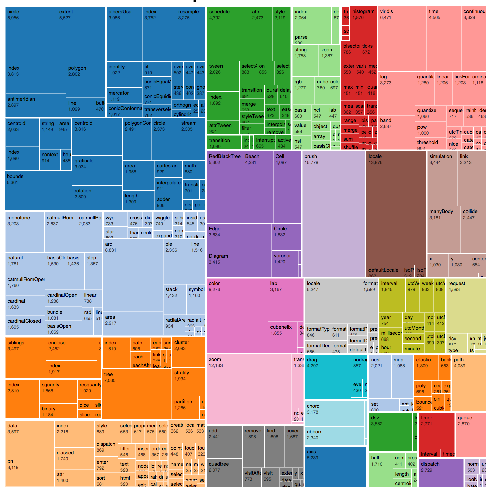
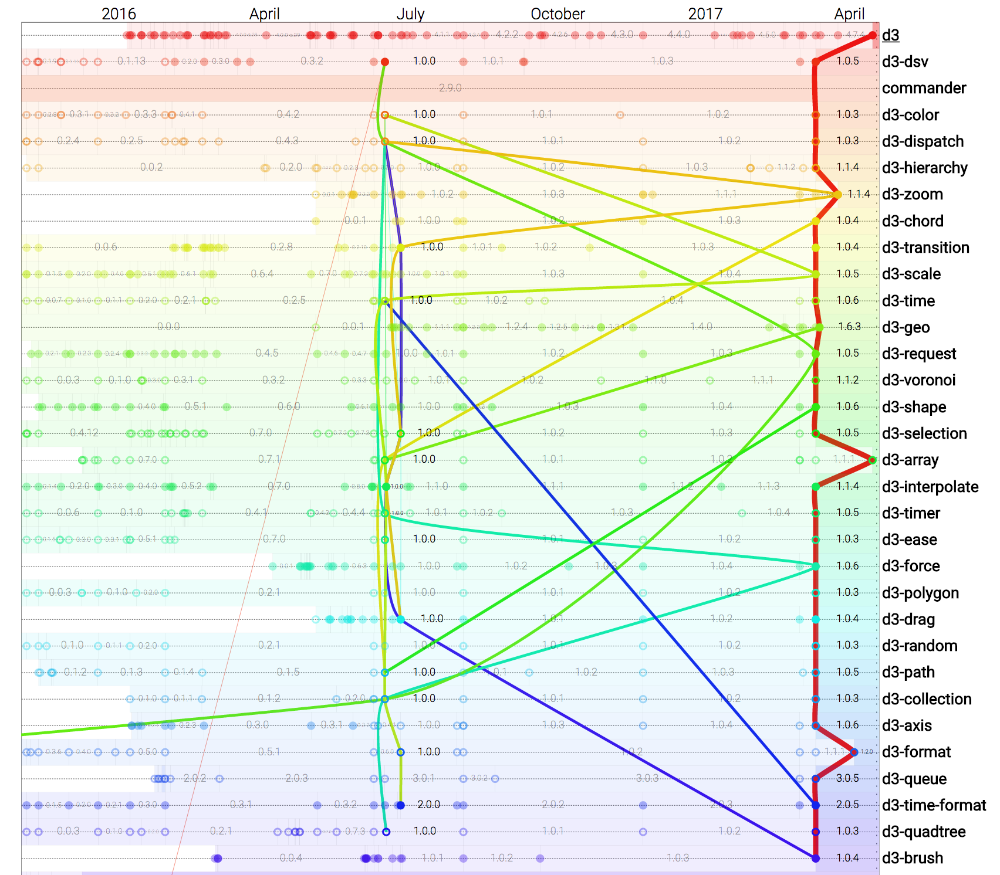
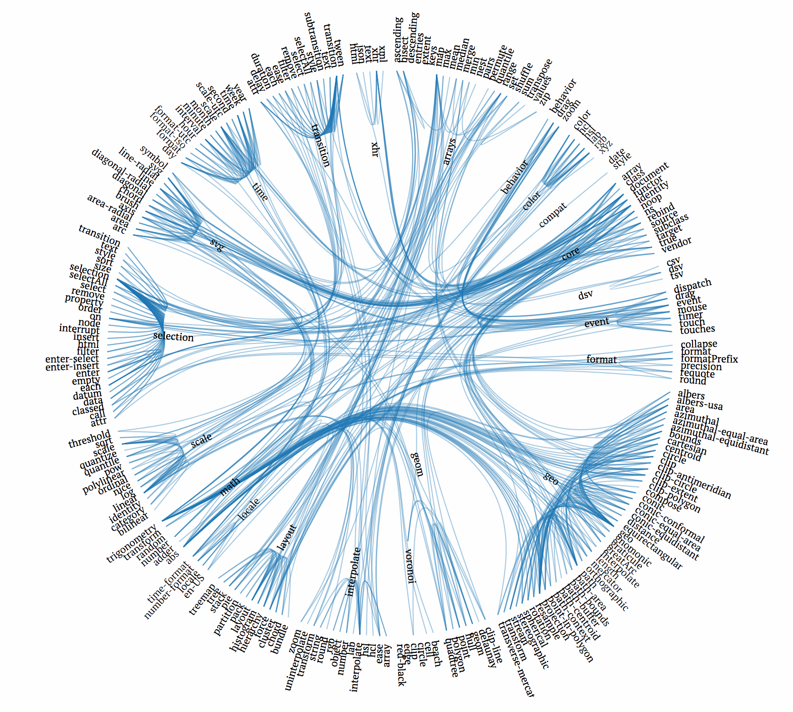
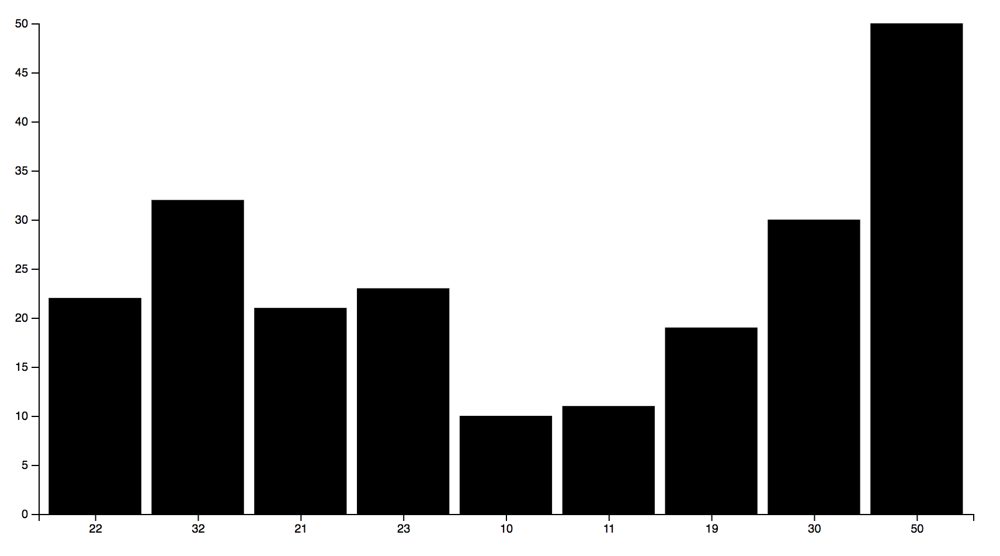

# STEP 01

Goals:

* Using D3 microlibraries instead of full D3 library
* Create a custom D3 bundle for the bar chart
* Adding scales and axis to the bar chart

## Use of D3 microlibraries

So we loaded the whole file, was it a good thing? D3 is actually a bit fat.

```sh
> cat ../00/result/node_modules/d3/build/d3.js | wc -c
> 
> 458342
```

We actually only need a couple of D3 functions:

```json
select()
append()
attr()
selectAll()
data()
enter()
```

..Which are inside the [`d3-selection`](https://github.com/d3/d3-selection) module:

```
> cat ../00/result/node_modules/d3-selection/build/d3-selection.js | wc -c
> 
> 26035
```

BTW, same as the one delivered by D3 cdn:

```
> curl -s https://d3js.org/d3-selection.v1.js | wc -c
> 
> 26035
```

If you want to learn more on the `d3-selection` api

* https://github.com/d3/d3-selection#event
* https://github.com/d3/d3-selection#select
* https://github.com/d3/d3-selection#selectAll

Hopefully, d3 is now a collection of separate, specialized modules, with a public API.

```
> npm search d3
NAME              | DESCRIPTION          | AUTHOR          | DATE       | VERSION
d3                | Data-Driven…         | =mbostock…      | 2017-04-15 | 4.8.0         
d3-gridding       | Grid partitions for… | =romsson        | 2017-04-08 | 0.0.10  
d3-object-charts  | Library of…          | =arbolista…     | 2017-02-14 | 1.2.9 
d3-scale          | Encodings that map…  | =mbostock       | 2017-03-10 | 1.0.5 
d3-queue          | Evaluate…            | =mbostock       | 2017-03-10 | 3.0.5 
..........
```

Let's have a look at those modules and how their are connected to each others:







Links:

* [D3 Source Treemap](https://bl.ocks.org/mbostock/8fe6fa6ed1fa976e5dd76cfa4d816fec)
* [D3 modules dependencies time graphs](https://mindrones.github.io/timely-dependency-graph/)
* [Dependencies between source files for D3 version 3.4.13](https://www.jasondavies.com/d3-dependencies/)

First you remove d3 from the previous package (if you want to keep the previous one):

```
npm init --yes
npm install d3 --save
npm uninstall d3 --save
npm install d3-selection --save
```

The new `package.json` has the following dependency:

```
"dependencies": {
  "d3-selection": "^1.0.5"
}
```

So we can the bar chart replace the header with:

```
<script src="node_modules/d3-selection/build/d3-selection.js"></script>
```

> cat ../01/node_modules/d3-selection/build/d3-selection.js | wc -c
>   26035

You can even save some more space using the minified version:

```
node_modules/d3-selection/build/d3-selection.min.js
```

> cat ../01/node_modules/d3-selection/build/d3-selection.min.js| wc -c
>   13095

The minified and gzipped bundle is only 13,095 bytes, which saves 50% over the non-minified version.

## Create a custom JS bundle

We now create a ES2015 module. This will be usefull for further customzation of our D3 build.

>💡**[`Rollup.js`](https://rollupjs.org/)** is a module bundler for JavaScript which compiles small pieces of code into a something larger and more complex, such as a library or application. 

Install rollup for use using the [command line interface](https://github.com/rollup/rollup/wiki/Command-Line-Interface#examples):

`npm install --global rollup`

Let's create a dummy file using the default [bundle format](https://github.com/rollup/rollup/wiki/JavaScript-API#format) `iife`:

First, create a  `index.js` file is your module end / entry point. TODO: You could name it whatever you want. If you change it you should update package.json's "main" property to match.

```
echo "console.log('test');" >> app.js
rollup --format iife -- app.js > app-build.js
```

The result:

```
(function () {
        'use strict';
        console.log('test');
}());
```

It added a `'use strict'` command.

>💡**[`strict mode`](https://developer.mozilla.org/en-US/docs/Web/JavaScript/Reference/Strict_mode/Transitioning_to_strict_mode)** ECMAScript 5 introduced strict mode which is now implemented in all major browsers (including IE10). While making web browsers interpret code as strict is easy (just add 'use strict'; at the top of your source code), transitioning an existing code base to strict mode requires a bit more work.

The default bundling mode is `iife`

>💡**[iife](https://developer.mozilla.org/en-US/docs/Glossary/IIFE)** A self-executing function, suitable for inclusion as a script tag. (If you want to create a bundle for your application, you probably want to use this, because it leads to smaller file sizes.)

Advised to use `umd` which is compatible with most script loaders (e.g. RequireJS, etc.) 

>💡**[`umd`](https://github.com/umdjs/umd)** (Universal Module Definition) patterns for JavaScript modules that work everywhere.

See the difference when using `umd` module format:

```
(function (global, factory) {
        typeof exports === 'object' && typeof module !== 'undefined' ? factory() :
        typeof define === 'function' && define.amd ? define(factory) :
        (factory());
}(this, function () { 'use strict';

        console.log('test');

}));
```

Let's make a slightly more advanced module. Create a `src/module.js` file using:

```
export default function() {
  return 123;
};
```

Update the `index.js` with

```
export {default as mymod} from "./src/mymod";
```

Now transpile

```
rollup -f umd -n d3 -o build/d3-mymod.js -- index.js
```

Note that we are now adding a [module name](https://github.com/rollup/rollup/wiki/JavaScript-API#modulename) in the build file `build/d3-mymod.js`

```
(function (global, factory) {
  typeof exports === 'object' && typeof module !== 'undefined' ? factory(exports) :
  typeof define === 'function' && define.amd ? define(['exports'], factory) :
  (factory((global.d3 = global.d3 || {})));
}(this, function (exports) { 'use strict';

  function mymod() {
    return 123;
  };

  exports.module = mymod;

  Object.defineProperty(exports, '__esModule', { value: true });

}));
```

Which makes the function `d3.mymod()` now available

## Create a custom D3 bundle

If you recall, we actually don't even need all of d3-selection functions and only use a few of them. Let's create our own [custom D3 bundle](https://bl.ocks.org/mbostock/bb09af4c39c79cffcde4)!

Let's now use `rollup` using the package.json file:

```
npm install rollup --save-dev
npm install rollup-plugin-node-resolve --save-dev
```

Create a `rollup.config.js` file containing all the options we need

```
import node from "rollup-plugin-node-resolve";

export default {
  entry: "index.js",
  format: "umd",
  moduleName: "d3",
  plugins: [node()],
  dest: "d3.js"
};
```

Finally, update the `index.js` file:

```
export {event, select, selectAll} from "d3-selection";
```

This example exposes just three fields on the d3 object: `d3.event`, `d3.select` and `d3.selectAll`.

> rollup -c

And now look at the resulting `d3.js`:

> cat d3.js | wc -c
>   24 668

..Compared to the `d3-selection.js` file (26,035 bytes) this is a 5.5% improvement.

Let's now create an uglyfied/minified version using `UglifyJS`.

>💡**[UglifyJS](https://www.npmjs.com/package/uglify-js)** is a JavaScript parser, minifier, compressor or beautifier toolkit.

Test [online](http://lisperator.net/uglifyjs/#demo) what it does.

Add it to the devDevdependencies

```
npm install uglifyjs --save-dev
```

We that we just added another kind of dependency:

`npm install <package_name> --save`

We can also add another type of dependency for the processing using `devDependencies`:

`npm install <package_name> --save-dev`

Back to our custom D3 bundle:

```
uglifyjs d3.js -c -m -o d3.min.js
```

> cat d3.min.js | wc -c

Combine with `rollup`:

> rollup -c && uglifyjs d3.js -c -m -o d3.min.js

Add this script to `package.json`.

```
"scripts": {
  "prepublish": "rollup -c && uglifyjs d3.js -c -m -o d3.min.js"
},
```

Check our chart works with the following include:

```html
  <script src="d3.min.js"></script>
```

## Adding D3 scales and axis

* Adding scale functions using [`d3-axis`](https://github.com/d3/d3/blob/master/API.md#axes-d3-axis)
* Use convenient array functions

In the `index.js` file

```
import "d3-scale";
import "d3-transition";
```

Finally run `rollup -c -f umd -n d3 -o d3.js -- index.js` 

Test with the bar chart!





### Notes

* [Exploringjs modules](http://exploringjs.com/es6/ch_modules.html)

## Next

Go to [STEP 02](../02/) →
