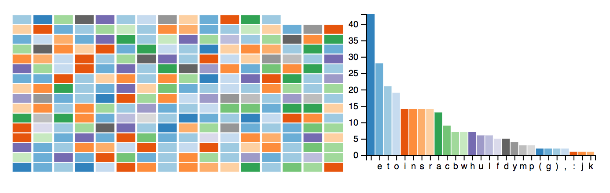

# Step 03

Goals

* Add multiple charts in the same web page
* Coordinate the charts
* Make the chart responsive

## Multiple coordinated chart

Inspired by http://square.github.io/crossfilter/

* Create a list of charts
* Render them all
* Update their internal state (filter, ..)



```js
  var charts = [
    gridChart()
      .width(200)
      .height(100),

    barChart()
      .width(300)
      .height(200)
  ]
```

renderAll

```js
function filter(filters) {
    filters.forEach(function(d, i) { charts[i].filter(d); });
    renderAll();
  };

function reset(i) {
    charts[i].filter(null);
    renderAll();
  };

function renderAll() {
  chart.each(render);
  list.each(render);
  d3.select("#active").text(formatNumber(all.value()));
}
```


Nesting datasets (see [d3.nest](http://bl.ocks.org/phoebebright/raw/3176159/))

```json
var nested_data = d3.nest().key(key)
    .rollup(function(leaves) { return leaves.length; })
    .entries(data);
```

### Notes

* [Exploring Reusability with D3.js](https://bocoup.com/blog/reusability-with-d3)
* [Reusable and Extendable D3 Charts](https://537.io/reusable-and-extendable-d3-charts/)
* [Add list of events and dispatch](https://github.com/cid-harvard/vis-toolkit/blob/master/src/events.js)

## Responsive chart

In its [simple form](http://eyeseast.github.io/visible-data/2013/08/28/responsive-charts-with-d3/), it is actually quite straightforward

```js
  var width = window.innerWidth,
      height = window.innerHeight;

  var data = [22, 32, 21, 23, 10, 22, 11, 19, 30, 50];

  var chart = barChart().width(width).height(height);

  d3.select("body")
      .datum(data)
      .call(chart);

  d3.select(window).on('resize', resize);

  function resize() {

    width = window.innerWidth;
    height = window.innerHeight;

    chart.width(width).height(height);

    d3.select("body")
        .call(chart);

  }
```

However, the chart's representation should change according to some [breakpoints](https://v4-alpha.getbootstrap.com/layout/overview/).

## Next

Go to [STEP 04](../04/) →
